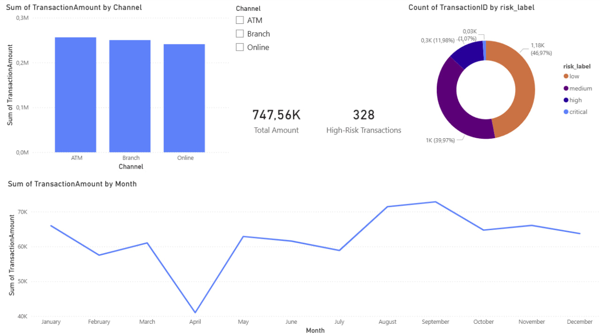

# ETL Pipeline — Bank Transaction Risk Analysis

Bank transactions contain patterns — unusual login attempts, high-value
transfers, ATM anomalies — that compliance teams use to flag suspicious
activity. This pipeline automates that process: it ingests a real dataset
of 2,500+ transactions, engineers risk features, loads the results into
PostgreSQL, and produces analytical reports in CSV format.

**Dataset:** [Bank Transaction Dataset for Fraud Detection](https://www.kaggle.com/datasets/valakhorasani/bank-transaction-dataset-for-fraud-detection/data) — Kaggle

---

## Pipeline Architecture

```
CSV (Kaggle) → Extract (pandas) → Transform (clean + enrich) → Load (PostgreSQL) → SQL Reports (CSV) → Power BI Dashboard
```

---

## Tech Stack

| Layer               | Technology           |
| ------------------- | -------------------- |
| Data processing     | Python 3, pandas     |
| Database            | PostgreSQL           |
| DB connectivity     | psycopg2, SQLAlchemy |
| Credential security | python-dotenv        |
| Visualization       | Power BI             |

---

## Analytics Dashboard (Power BI)

Interactive dashboard built on top of the pipeline output, visualizing transaction volumes, risk distribution, and monthly trends across 2,500+ transactions.

: 

**Visuals:**

- Transaction volume by channel (ATM / Branch / Online)
- Risk label distribution (low / medium / high / critical)
- Monthly transaction volume trend
- KPI cards: Total Volume ($747.56K) and High-Risk Transactions (328)
- Interactive channel slicer to filter all visuals simultaneously

---

## Feature Engineering

| Feature               | Logic                                                 |
| --------------------- | ----------------------------------------------------- |
| `is_high_value`       | `TransactionAmount > 500.0`                           |
| `is_suspicious_login` | `LoginAttempts > 3`                                   |
| `is_atm_transaction`  | `Channel == "ATM"`                                    |
| `is_long_duration`    | `TransactionDuration > 200`                           |
| `risk_score`          | Sum of the four boolean flags above (0–4)             |
| `risk_label`          | `0 → low`, `1 → medium`, `2 → high`, `3–4 → critical` |

---

## Key Findings

**Q1 — Total transaction volume by channel:**

| Channel | Transaction Count | Total Amount | Avg Amount |
| ------- | ----------------- | ------------ | ---------- |
| ATM     | 833               | 256,331.43   | 307.72     |
| Branch  | 868               | 250,183.00   | 288.23     |
| Online  | 811               | 241,041.14   | 297.21     |

ATM has the highest total transaction volume at $256,331.43.

**Q2 — High-risk transactions (risk_label = high or critical), ordered by risk score and amount:**

328 transactions flagged as high or critical risk. Top results:

| TransactionID | AccountID | TransactionAmount | Channel | LoginAttempts | TransactionDuration | risk_score | risk_label |
| ------------- | --------- | ----------------- | ------- | ------------- | ------------------- | ---------- | ---------- |
| TX000455      | AC00264   | 611.11            | ATM     | 4             | 282                 | 4          | critical   |
| TX001498      | AC00018   | 1228.81           | ATM     | 1             | 254                 | 3          | critical   |
| TX000275      | AC00454   | 1176.28           | ATM     | 5             | 174                 | 3          | critical   |
| TX001797      | AC00146   | 1135.80           | ATM     | 1             | 250                 | 3          | critical   |
| TX001013      | AC00257   | 963.77            | ATM     | 1             | 248                 | 3          | critical   |

**Q3 — Accounts with repeat suspicious activity (risk_score ≥ 2, more than one occurrence):**

73 accounts were identified with repeat suspicious transactions.

**Q4 — Transactions above average amount:**

952 transactions exceed the dataset's average transaction amount.

---

## Project Structure

```
financial-etl-pipeline/
├── data/                          ← not committed, download from Kaggle
├── reports/                       ← auto-generated, not committed
├── src/
│   ├── config.py
│   ├── extract.py
│   ├── transform.py
│   ├── load.py
│   └── queries.sql
├── main.py
├── requirements.txt
├── README.md
├── .env                           ← not committed, see .env.example
└── .env.example
```

---

## Setup

1. Clone the repository:

   ```
   git clone https://github.com/caverraaa/financial-etl-pipeline.git
   cd financial-etl-pipeline
   ```

2. Create and activate a virtual environment:

   ```
   python3 -m venv venv
   source venv/bin/activate
   ```

3. Install dependencies:

   ```
   pip install -r requirements.txt
   ```

4. Copy `.env.example` to `.env` and fill in your PostgreSQL credentials:

   ```
   cp .env.example .env
   ```

5. Download the dataset from Kaggle and place the CSV file in the `data/` directory.

6. Run the pipeline:
   ```
   python3 main.py
   ```
